# AISSUE

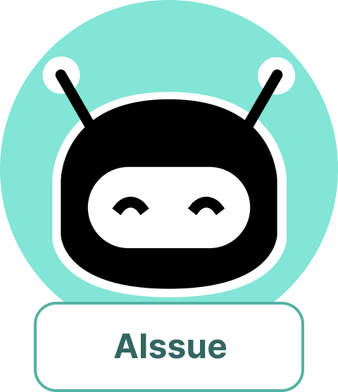


## 📅 **프로젝트 기간**

- 2024.10.14 ~ 2024.11.19

## 🙇🏻‍♂️ **팀원소개**

<div align="center">
  
| [최희현](https://github.com/choiheehyun) | [전태호](https://github.com/Taehororo) | [김성현](https://github.com/k-redstone) | [서승호](https://github.com/shocoding) | [주소영](https://github.com/address0) |[장승연](https://github.com/yoonkyungseo) |
| :----------------------------------: | :-----------------------------------: | :-----------------------------------: | :-----------------------------------: | :-----------------------------------: | :-----------------------------------: | 
|||||||
|          FE, DESIGN          |                  FE, BE                  |              BE            |               INFRA, FE              |              FE, AI,DESIGN           |              FE              |

</div>

## 🧑🏻‍💻 개발 관련 기술

### 📋 git 이슈/브랜치 관리

### issue

- 프론트엔드와 백엔드, 데이터는 `label`로 분류한다.
- `assignees`는 이슈 생성자가 스스로 할당한다.
- 이슈 타입

  ```markdown
  FEAT : 새로운 기능 추가
  FIX : 버그 수정
  HOTFIX : 치명적인 버그 급하게 수정
  CHORE : (코드 수정 없는) 설정 변경
  DOCS : 문서 생성 및 수정
  DESIGN : 레이아웃 구현 및 디자인 수정
  REFACTOR : 리팩토링
  REMOVE : 파일/코드 삭제
  MERGE : 브랜치 병합
  ```

- 작성 예시
  **[타입] 이슈 명**
  - [FEAT] PWA 구현
  - [DESIGN] 랜딩 페이지 레이아웃 디자인

### branch

- 프론트엔드, 백엔드, 데이터는 접두사로 **`FE/ BE/ DATA/`** 를 붙인다.
- 브랜치 생성 시, 영문은 모두 **소문자**를 사용한다.
- git flow 방식을 채용하여 dev branch로 protect한다.
- 완료 된 작업에 대하여 PR 완료 이후 해당 작업 브랜치는 삭제한다.

### commit

- 영문은 모두 **소문자**를 사용한다.
- 한글도 가능하다.
- 생성 예시
  - docs: TIL 생성
  - feat: PWA setting

### merge

- 영문은 모두 **소문자**를 사용한다.
- 내용은 템플릿을 사용한다.

### 👩🏻‍🔧 **기술 스택**

<div align="left">

### FE

---

#### 🚀 프레임워크 및 라이브러리

  
  
   
  
  #### 📊 상태 관리
   
  
  
  #### 📡 데이터 요청
  
  
  #### 💄 스타일링
   
  
  
  #### 🔧 코드 품질 관리
  
  

### BE

---

#### 🚀 프레임워크 및 라이브러리

 
 


#### 📂 DB 및 스토리지

 
 


### AI

---


### INFRA

---

#### 🔗 CI/CD

 
 


## 역할 분담

### 🍊최희현

- **FE**
  - 프론트 엔드 전반적 담당
  - 기본적인 디자인 담당
  - 프로젝트 정보, 전체 업무 로그, 프로젝트 일정
  - 모바일 반응형 디자인 추가

<br>
    
### 👻전태호

- 프론트, 백 기본 설정

- **FE**
  - 페이지 : 로그인, 회원가입, 실시간 채팅, 채팅 봇, 프로젝트 정보, 채팅 요약, pwa 설정
  - 공통 컴포넌트 : 채팅 모달
- **BE**
  - 프로필 설정 및 수정 페이지 유저 아이디 유효성 및 중복 검사, 실시간 채팅, 채팅 메세지, 채팅 요약, 채팅 요약 스케줄링, 에러 핸들링, 예외 핸들링, 백엔드 기본 설정

<br>

### 😎김성현

- **기획**

  - JIRA 번다운차트, 스프린트 관리
  - gitlab, frontend 코드 컨벤션 제작

- **BE**
  - jiraAPI를 이용한 통신 담당
  - issue 생성 및 수정
  - 스프린트 생성 및 수정
  - 에픽 생성 및 수정

### 🐱‍🏍서승호

- **INFRA**
  - 서버 관리 : 프런트, 백엔드 서버 관리
  - CI/CD 관리 : Docker를 사용해 Jenkins 파이프라인 관리
  - DB 인스턴스 관리 : mySQL, Redis 구축

<br>

### 🏓주소영

- **AI**
  - openAI api를 이용한 스프린트 자동 생성
  - 사용자와 대화형으로 정보 입력
  - 스프린트 내용 추가
- **DESIGN**
  - FIGMA 전체 와이어프레인 설계 및 전체 페이지 디자인
  - TailwindCSS 디자인가이드 제공
  - 컴포넌트 세부 디자인 코드 수정

<br>

### 🎯장승연

- **FE**
  - 달력 에픽 설정, 스프린트 설정 기능

<br>

## 📖 **ERD**

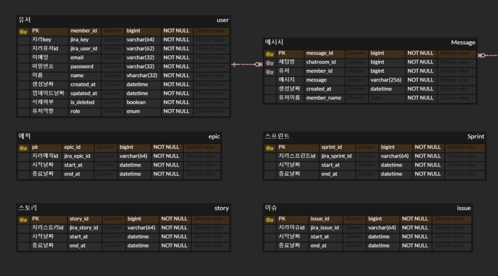
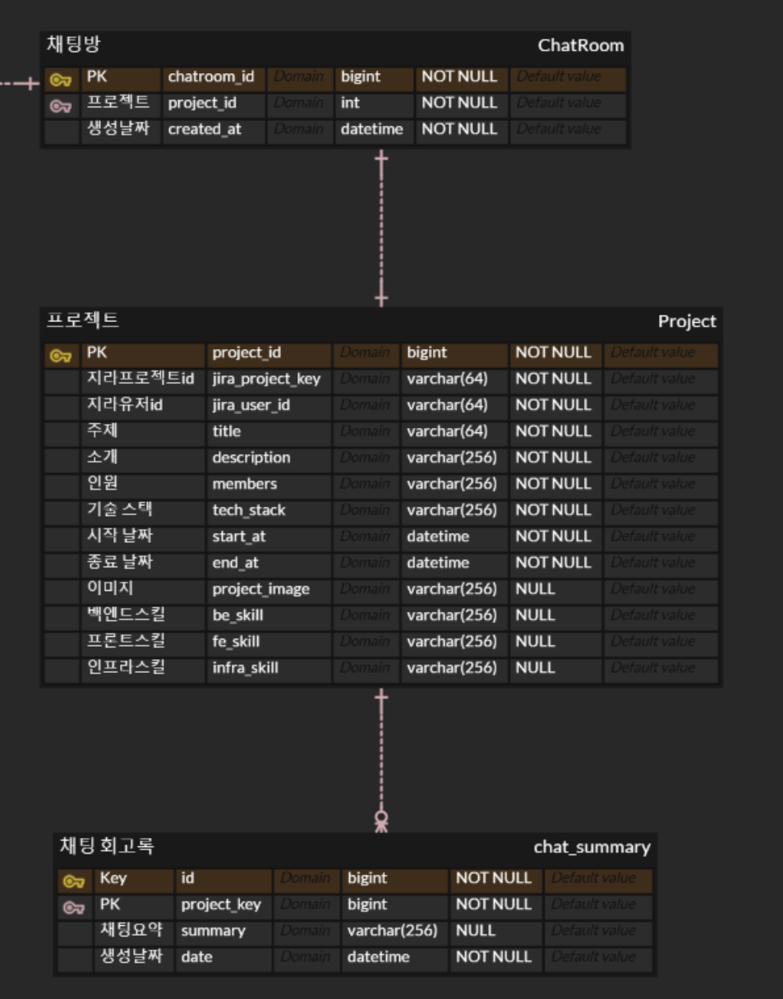

<br>

## 📖 **Architecture**

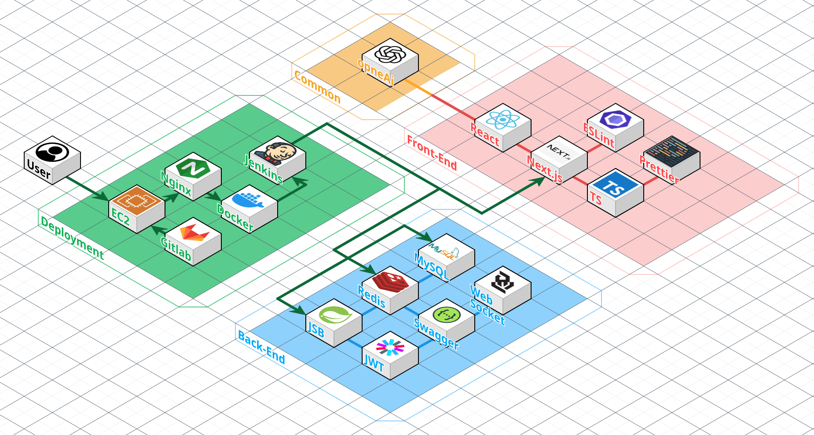

<br>

## 📖 **페이지별 기능**

### 1. 로그인

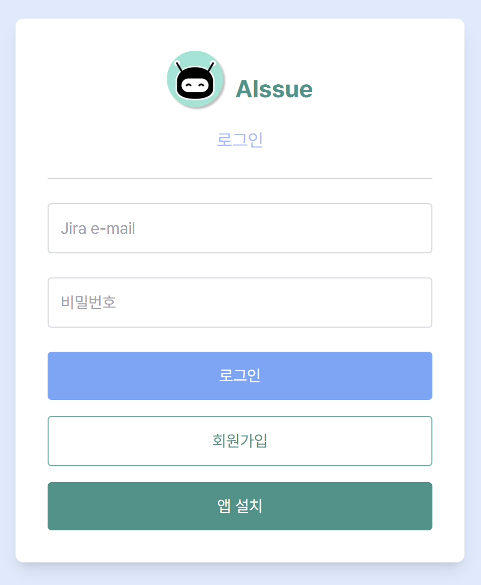

### 2. 프로젝트

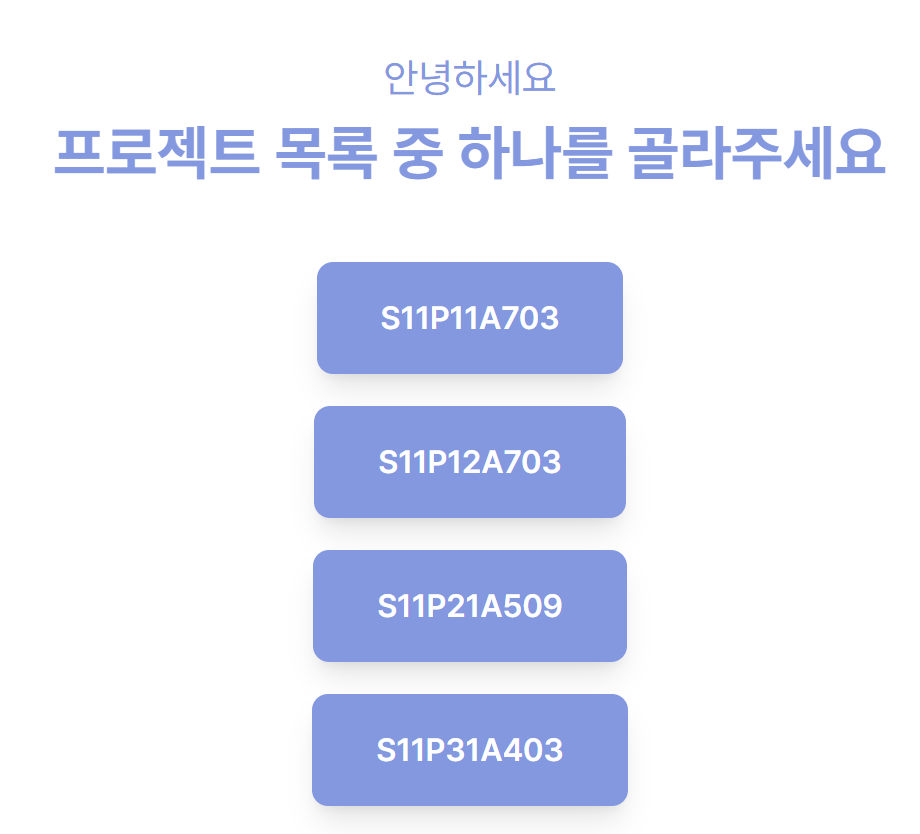

### 2-1 프로젝트 정보

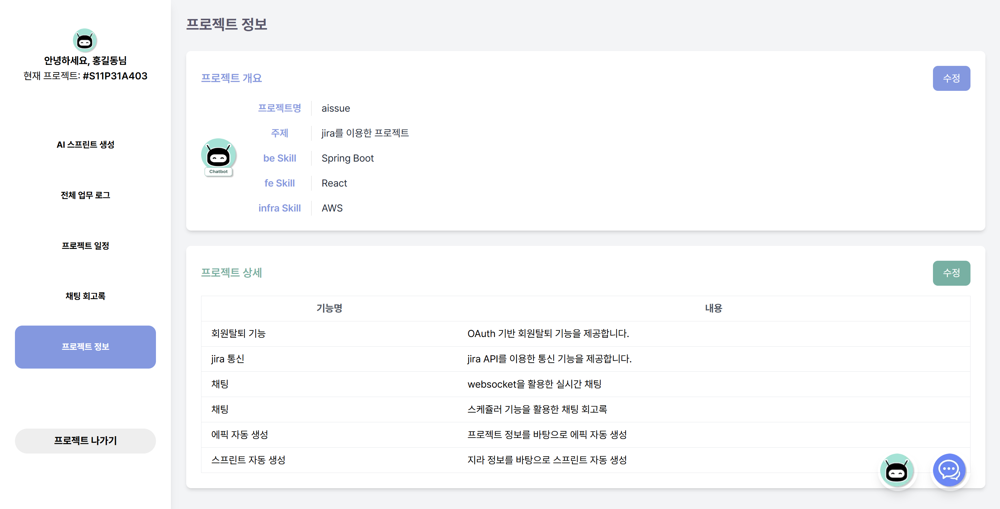

### 2-2 프로젝트 채팅 회고록

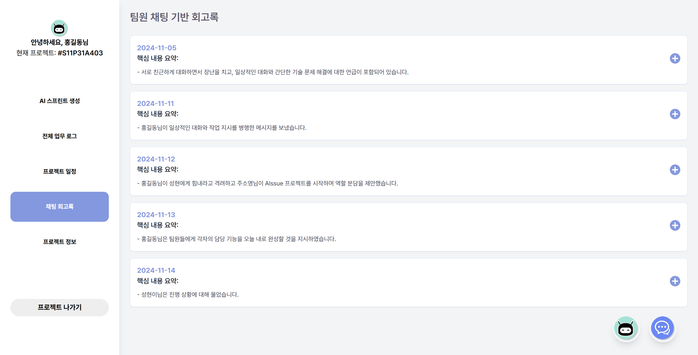
매일 자정마다 그날의 채팅을 요약및 정리해주는 회고록

### 2-3 프로젝트 채팅

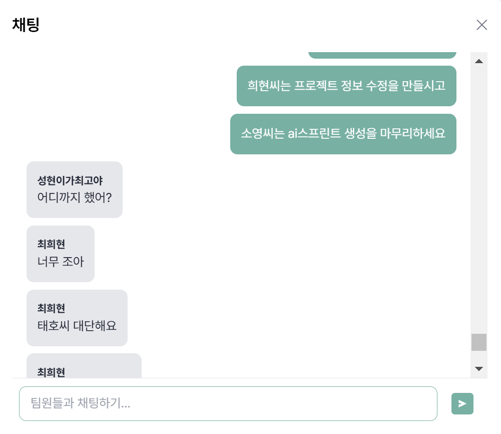
프로젝트 별 채팅

### 2-3 챗봇

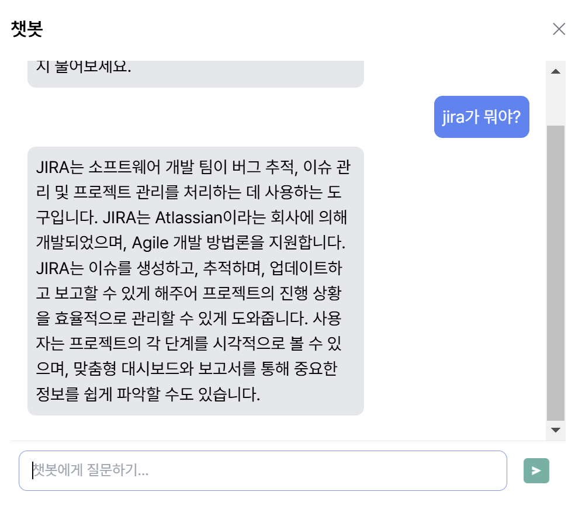
jira에 대해 물어볼 수 있는 챗봇

### 2-4 전체 업무 로그

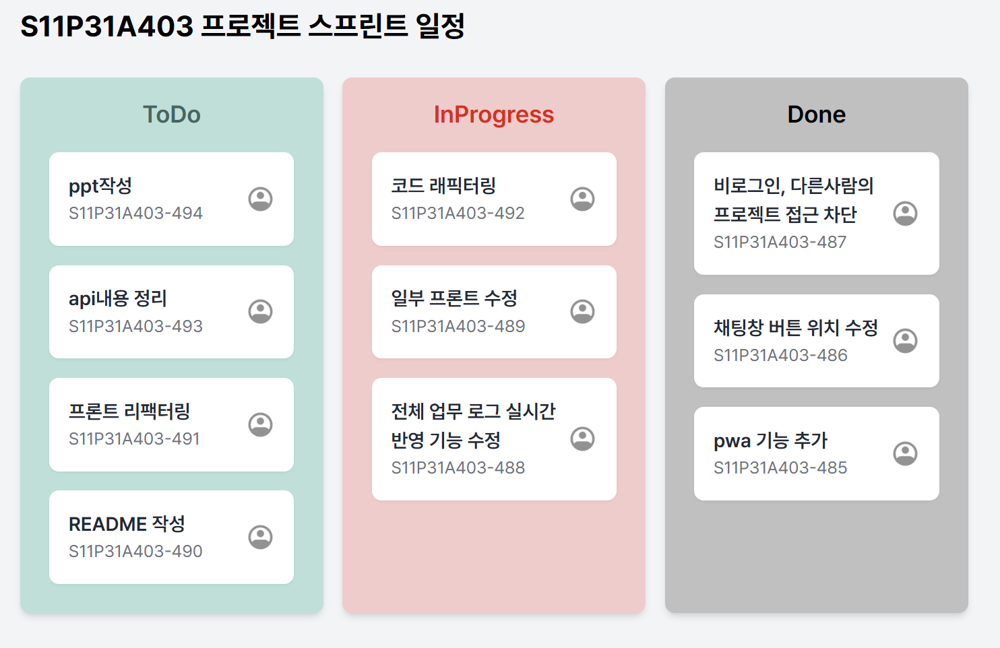
본인에게 할당된 이슈들을 편집 및 수정, 드래그 앤드롭 기능

### 2-4 전체 업무 로그 수정

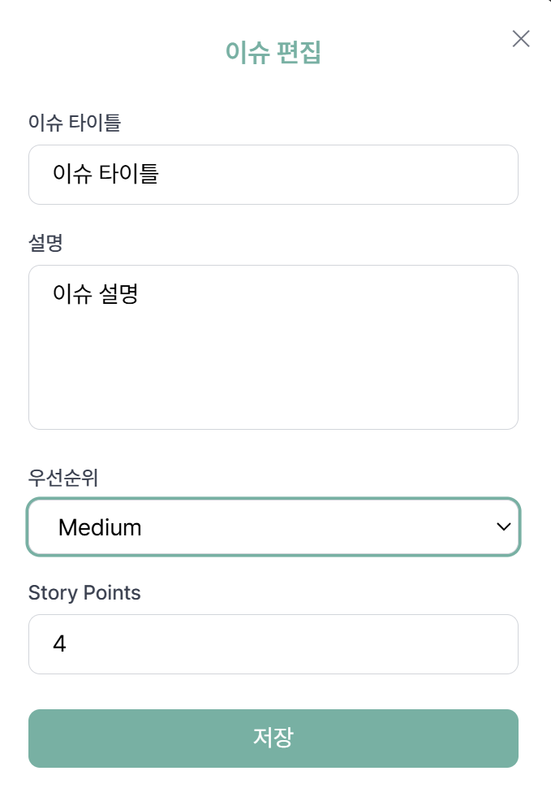
이슈 편집 및 수정

###

## ⚒️ **프로젝트 후기**

### 🍊최희현

JIRA를 활용한 프로젝트 관리를 보다 효과적으로 할 수 있는 방안을 구상하는 기회가 되었으며, 팀원들과의 원활한 소통과 실시간 협업의 중요성을 경험.

<br>
    
### 👻전태호
많은 것을 배울 수 있는 프로젝트였습니다. 곁에 든든한 프론트 팀원이 있다는게 정말 큰 힘이 되었습니다. 오직 개발에만 집중할 수 있도록 배려해준 팀원 덕분에 백엔드 개발에서 제가 할 수 있는 최대한을 보여줄 수 있었던 것 같습니다.
이렇게 제대로 된 분업이 프로젝트는 처음이라 이 경험을 양식 삼아 더욱 성장해나가겠습니다.

<br>

### 😎김성현

JIRA API와 통신하며 백엔드와의 상호작용을 깊이 있게 이해할 수 있었습니다. 스프린트 관리와 같은 복잡한 비즈니스 로직을 처리하며 로직 설계와 구현의 중요성을 배웠습니다. 팀원들과의 협업 속에서 원활한 커뮤니케이션과 기획의 중요성을 다시금 느꼈고, 프로젝트 관리의 체계적인 접근이 프로젝트 성공의 열쇠임을 깨달았습니다.
<br>

### 🐱‍서승호

인프라 구축을 처음 하면서, 항상 궁금했던 인프라 구축에 대해서 배울 수 있는 시간이었습니다.
직접 해보니 간단하면서도 어려운 부분이 있었고, 직접 해보니 전체 구조를 더 잘 이해할 수 있었습니다.
다만, 조금 더 효율적으로 인프라 구축을 할 수 있겠다는 부분이 있었는데,
전체 프로젝트 마감을 지키기 위해서 수정을 못했는데 다음번에는 조금 더 효율적으로 인프라 구축을 해보고 싶습니다.

<br>

### 🏓주소영

디자인과 AI 기능을 융합하며 사용자 경험을 극대화하는 방법에 대해 배울 수 있었습니다. 특히 TailwindCSS를 활용해 디자인 가이드를 제공하며 효율적인 스타일링 작업이 가능하다는 점을 깨달았습니다. 또한, OpenAI API를 적용하면서 AI가 프로젝트 생산성을 크게 높일 수 있다는 가능성을 체감했고, 이 기술이 프로젝트 관리 툴에 주는 영향력을 실감했습니다.
<br>

### 🎯장승연

프론트엔드 작업을 진행하면서 달력 및 스프린트 설정과 같은 세부 기능 구현의 중요성을 깨달았습니다. 사용자 중심의 인터페이스 설계를 목표로 하며 프로젝트의 사용성을 높이는 방법을 고민하게 되었고, 이를 통해 UI/UX에 대한 깊은 통찰을 얻을 수 있었습니다. 팀원들과의 협업이 큰 힘이 되었으며, 한정된 시간 속에서도 완성도 있는 결과물을 만들어낸 점에 보람을 느낍니다.
<br>
